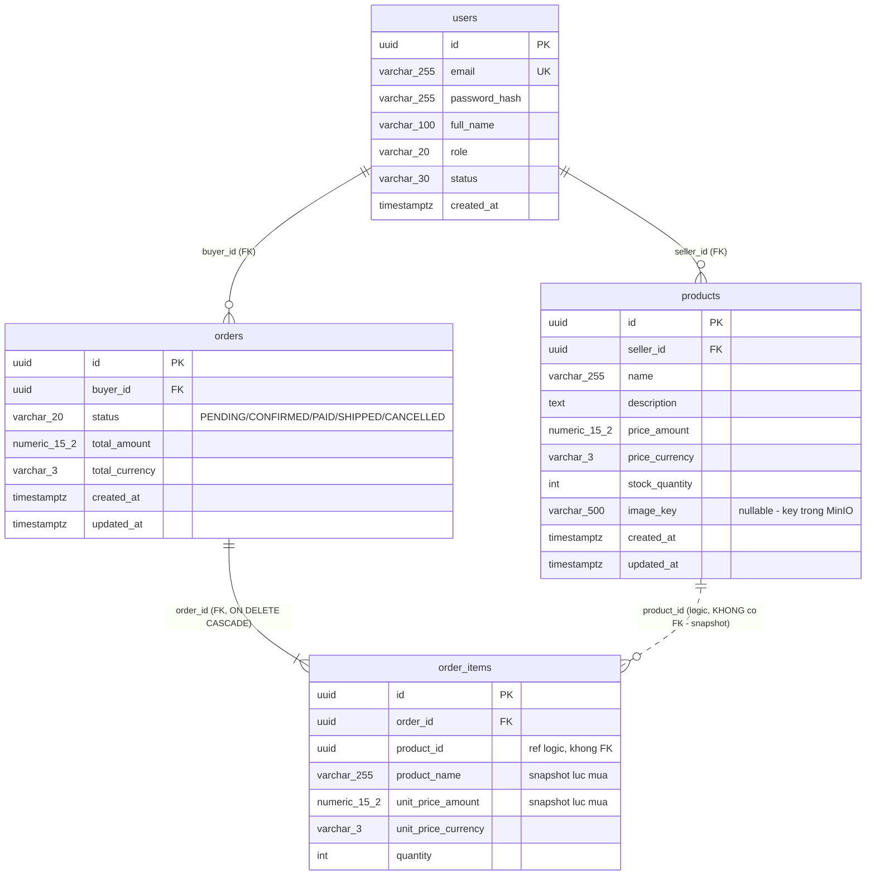

# ERD Database

Bản trực quan: https://claude.ai/code/artifact/cc5f0e82-10f2-4b74-bfe3-07f3bde37483

## Quyết định thiết kế

1. **`order_items.product_id` cố ý KHÔNG có FK** — đơn hàng lưu snapshot (tên + giá lúc mua); seller đổi giá/xóa sản phẩm không được ảnh hưởng đơn đã đặt. FK cứng sẽ chặn xóa product.
2. **`order_items.order_id` có ON DELETE CASCADE** — item là thành phần trong Order aggregate, không có đời sống riêng.
3. **Tiền = cặp cột** `*_amount numeric(15,2)` + `*_currency varchar(3)` — ánh xạ VO `Money`. Không dùng float cho tiền.
4. **`image_key` nullable** — con trỏ tới object MinIO, file thật không nằm trong DB.
5. **Enum lưu dạng chữ** — đọc bằng mắt hiểu ngay, thêm giá trị không cần migrate.
6. **Index**: users(email), products(seller_id), products(created_at DESC), orders(buyer_id), orders(created_at DESC), order_items(order_id).
7. Bảng `flyway_schema_history` do Flyway tự quản — không đụng vào.
